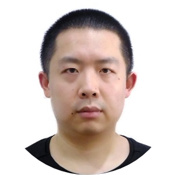
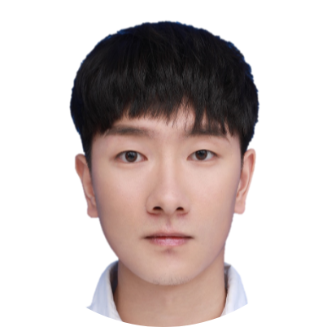
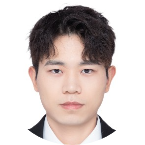

---
# Leave the homepage title empty to use the site title
title:
date: 2022-10-24
type: landing

sections:
#  - block: markdown
#    id: imghead
#    content:
#      title: |-
#        **WestLake Nlp Lab**
#      subtitle: ''
#      text:
#        
Lexical, syntactic and semantic representation and analysis in Chinese and English basic natural language processing.
#        

#    design:
#      spacing:
#        # Customize the section spacing. Order is top, right, bottom, left.
#        padding: ["150px", "0", "150px", "0"]
#      background:
#        color: black
#        text_color_light: true
#        image:
#          # Add your image background to `assets/media/`.
#          filename: ww.jpg
#          filters:
#            brightness: 0.4
#          size: cover
#          position: center
#          parallax: false
  - block: hero
    id: introduction
    content:
      title: 
        WestlakeNLP 自然语言处理实验室
      image:
        filename: sch.png
      text: |-
        Prof. Zhang's main research interests are natural language processing, machine learning and text mining, working on machine learning and inference algorithms for structural prediction, statistical parsing, Chinese syntactic processing, text generation, machine translation, text summarization, dialogue system, information extraction, sentiment analysis and financial market predication.

#        **Current Research Interest**
#        

#        + natural language processing
#        + artificial intelligence
#        
#  - block: about.avatar
#    id: about
#    content:
      # Choose a user profile to display (a folder name within `content/authors/`)
#      username: admin
      # Override your bio text from `authors/admin/_index.md`?
#      text:
  - block: collection
    id: posts
    content:
      title: 
        Recent News
      subtitle: ''
      text: ''
      # Choose how many pages you would like to display (0 = all pages)
      count: 2
      # Filter on criteria
      filters:
        folders:
          - post
        author: ""
        category: ""
        tag: ""
        exclude_featured: false
        exclude_future: false
        exclude_past: false
        publication_type: ""
      # Choose how many pages you would like to offset by
      offset: 0
      # Page order: descending (desc) or ascending (asc) date.
      order: desc
    design:
      # Choose a layout view
      view: compact
      columns: '2'
#  - block: portfolio
#    id: projects
#    content:
#      title: Projects
#      filters:
#        folders:
#          - project
      # Default filter index (e.g. 0 corresponds to the first `filter_button` instance below).
#      default_button_index: 0
      # Filter toolbar (optional).
      # Add or remove as many filters (`filter_button` instances) as you like.
      # To show all items, set `tag` to "*".
      # To filter by a specific tag, set `tag` to an existing tag name.
      # To remove the toolbar, delete the entire `filter_button` block.
#      buttons:
#        - name: All
#          tag: '*'
#        - name: Deep Learning
#          tag: Deep Learning
#        - name: Other
#          tag: Demo
#    design:
      # Choose how many columns the section has. Valid values: '1' or '2'.
#      columns: '1'
#      view: showcase
      # For Showcase view, flip alternate rows?
#      flip_alt_rows: false
  - block: markdown
    id: people
    content:
      title: |-
        People
      subtitle: ''
      # Choose a user profile to display (a folder name within `content/authors/`)
      # Override your bio text from `authors/admin/_index.md`?
      text: |-
        ## Faculty
        <table width="100%" align="center" style="table-layout:fixed;">
            <tr>
                <td align="center" style="margin-bottom:40px"><h4><a href="https://frcchang.github.io/" style="text-decoration: none;">Yue Zhang</a></h4>Tenured Full Professor</td>
            </tr>
        </table>
        
        ## Research Faculty
        <table width="100%" align="center" style="table-layout:fixed;">
                
        </table>

        ## Post Doc
        <table width="100%" align="center" style="table-layout:fixed;">
            <tr>
                <td align="center" style="margin-bottom:40px"><h4>Lu Cao</h4>Post Doc</td>
                <td align="center" style="margin-bottom:40px"><h4><a href="https://www.linyi-yang.me/" style="text-decoration: none;">Linyi Yang</a></h4>Post Doc</td>
                <td align="center" style="margin-bottom:40px"><h4><a href="https://scholar.google.com/citations?user=bKaielcAAAAJ&hl=en" style="text-decoration: none;">Qiji Zhou</a></h4>Post Doc</td>
                <td align="center" style="margin-bottom:40px"><h4>Yingjie Li</h4>Post Doc</td>
            </tr>
        </table> 

        ## PhD Students
        <table width="100%" align="center" style="table-layout:fixed;">
            <tr>
                <td align="center" style="margin-bottom:40px"><h4>Chen Jia</h4>PhD Student</td>            
                <td align="center" style="margin-bottom:40px"><h4><a href="https://elliottyan.github.io/" style="text-decoration: none;">Jianhao Yan</a></h4>PhD Student</td>
                <td align="center" style="margin-bottom:40px"><h4><a href="https://scholar.google.com/citations?user=8P23zSkAAAAJ&hl=en" style="text-decoration: none;">Yulong Chen</a></h4>PhD Student</td>
                <td align="center" style="margin-bottom:40px"><h4>Wenyang Gao</h4>PhD Student</td>
                <td align="center" style="margin-bottom:40px"><h4>Fang Guo</h4>PhD Student</td>                                
            </tr>
            <tr>
                <td align="center" style="margin-bottom:40px"><h4><a href="https://www.dtalg.com/" style="text-decoration: none;">Hanmeng Liu</a></h4>PhD Student</td>  
                <td align="center" style="margin-bottom:40px"><h4><a href="https://scholar.google.com/citations?user=gEceD-sAAAAJ&hl=en" style="text-decoration: none;">Yafu Li</a></h4>PhD Student</td>
                <td align="center" style="margin-bottom:40px"><h4><a href="https://scholar.google.com/citations?user=B_bdRlAAAAAJ&hl=zh-CN&authuser=1" style="text-decoration: none;">Yun Luo</a></h4>PhD Student</td>
                <td align="center" style="margin-bottom:40px"><h4><a href="https://taolusi.github.io/qingkai_min/" style="text-decoration: none;">Qingkai Min</a></h4>PhD Student</td>
                <td align="center" style="margin-bottom:40px"><h4>Chiyu Song</h4>PhD Student</td>  
            </tr>
            <tr>
                <td align="center" style="margin-bottom:40px"><h4>Yaoxian Song</h4>PhD Student</td>
                <td align="center" style="margin-bottom:40px"><h4>Sixuan Wu</h4>PhD Student</td>
                <td align="center" style="margin-bottom:40px"><h4>Guangsheng Bao</h4>PhD Student</td>
                <td align="center" style="margin-bottom:40px"><h4><a href="https://wangcunxiang.github.io/" style="text-decoration: none;">Cunxiang Wang</a></h4>PhD Student</td>
                <td align="center" style="margin-bottom:40px"><h4>Zijie Yang</h4>co-supervisor</td> 
            </tr>
            <tr>
                <td align="center" style="margin-bottom:40px"><h4>Yongjing Yin</h4>PhD Student</td>
            </tr>
        </table> 

        ## Research Assistants
        <table width="100%" align="center" style="table-layout:fixed;">
            <tr>
                <td align="center" style="margin-bottom:40px"><h4>Hanxu Hu</h4>Westlake University</td>
                <td align="center" style="margin-bottom:40px"><h4>Pai Liu</h4>Westlake University</td>
                <td align="center" style="margin-bottom:40px"><h4><a href="https://yingpengma.github.io/" style="text-decoration: none;">Yingpeng Ma</a></h4>Westlake University</td>
                <td align="center" style="margin-bottom:40px"><h4><a href="https://qianlanwyd.github.io/" style="text-decoration: none;">Yidong Wang</a></h4>Weslake University</td>
                <td align="center" style="margin-bottom:40px"><h4>Yuefeng Shi</h4>Westlake University</td>
            </tr>
            <tr>
                <td align="center" style="margin-bottom:40px"><h4><a href="https://nlpz127.github.io/homepage/" style="text-decoration: none;">Panzhong Lu</a></h4>Weslake University</td>
            </tr>
        </table>

        ## Alummi
        - Post-doctors
          + Zhongqing Wang, Feb. 2016 -- Jan. 2017; now at Soochow University, China
          + Thien Hai Nguyen, Feb.2016 -- Jan. 2017; now at Alibaba in Singapore
          + Chingyun Chang, Mar. 2015 - Feb. 2016; now at Amazon London, UK
          + Yafeng Ren, Sep. 2015 -- Sep. 2016; now at Guangdong University of Foreign Studies, China
          + Meishan Zhang, Nov. 2014 - Nov. 2015; now works as associated professor at Tianjin University, China
          + Likun Qiu, Jan. 2014 - Jan. 2015; now research fellow at Alibaba, China

        - Research Assistants
          + Yueguan Wang, Oct. 2022 - Mar. 2023；now Master candidate at University of Tokyo, Japan
          + <a href="https://kyriezz.com" style="text-decoration: none;">Zhixuan Zhou</a>, Jun. 2019 - Jul. 2019; now Ph.d student at UIUC 
          + Yuze Gao, Oct. 2016 - Aug. 2018；now works as a research engineer at A-STAR*, Singapore
          + Yu Yuan, Aug. 2017 - Jun. 2018; now at Nanjing University of Information Science and Technology
          + Qi Liu, Mar. 2017 - Mar. 2018; now Ph.d candidate at University of Oxford
          + Ratish Puduppully, Mar. 2017 – Sep. 2017; now Ph.d candidate at University of Edinburgh
          + Homgmin Wang, Aug. 2016 – Aug. 2017; now Ph.d candidate at UCSB
          + Jiangming Liu, May. 2015 - Sep. 2017; now Ph.d candidate at University of Edinburgh
          + Hongshen Chen, Dec. 2015 – Jun. 2016; now at JD, China
          + Lin Li, Aug. 2015 -- Jan. 2016; now at Huawei, China
          + Yijia Liu, Nov. 2013 - Nov. 2014; now at Alibaba, China
          + Zhongye Jia, May. 2013 - Feb. 2014; Baosteel Central Research Institute, China
          

        - Graduated Phd Students
          + Jie Yang, now Assistant Professor at Zhejiang University, China
          + Fei Dong, now works at Ebay Shanghai, China
          + Tin D. Vo, currently a data scientist at  Chata.ai., Canada
          + Zhiyang Teng , currently works as a research associate at NTU, Singapore
          + Qiankun Fu , now Lecture at Zhejiang City College, China
          + Yile Wang , now Postdoc at Tsinghua University, China
          + Leyang Cui , now works at Tencent, China
          + Jian Liu , now Lecture at Putian University, China
    design:
      columns: '1'  
#  - block: markdown
#    content:
#      title: |-
#        Gallery
#      subtitle: ''
#      text: |-
#                   
#    design:
#      columns: '1'  
#  - block: collection
#    id: featured
#    content:
#      title: |-
#        Featured Publications
#      filters:
#        folders:
#          - publication
#        featured_only: true
#    design:
#      columns: '2'
#      view: card
  - block: collection
    id: publication
    content:
      title: |-
        Recent Publications
      text: |-
        {}
        Quickly discover relevant content by [filtering publications](./publication/).
        {}
      count: 15
      filters:
        folders:
          - publication
        exclude_featured: true
    design:
      columns: '2'
      view: citation
  - block: collection
    id: teaching
    content:
      title: Teaching
      count: 1
      filters:
        folders:
          - teaching
    design:
      columns: '2'
      view: compact
#  - block: collection
#    id: talks
#    content:
#      title: Recent & Upcoming Talks
#      count: 1
#      filters:
#        folders:
#          - event
#    design:
#      columns: '2'
#      view: compact
  - block: tag_cloud
    content:
      title: |-
        Popular Topics
    design:
      columns: '20'
  - block: contact
    id: contact
    content:
      title: 
        Join Us
      subtitle:
      text: |-
        Welcome to join us!
      # Contact (add or remove contact options as necessary)
      email: zhangyue@westlake.edu.cn
#      phone: 888 888 88 88
#      appointment_url: 'https://calendly.com'
#      address:
#        street: 450 Serra Mall
#        city: Stanford
#        region: CA
#        postcode: '94305'
#        country: United States
#        country_code: US
#      directions: Enter Building 1 and take the stairs to Office 200 on Floor 2
#      office_hours:
#        - 'Monday 10:00 to 13:00'
#        - 'Wednesday 09:00 to 10:00'
#      contact_links:
#        - icon: twitter
#          icon_pack: fab
#          name: DM Me
#          link: 'https://twitter.com/Twitter'
#        - icon: skype
#          icon_pack: fab
#          name: Skype Me
#          link: 'skype:echo123?call'
#        - icon: video
#          icon_pack: fas
#          name: Zoom Me
#          link: 'https://zoom.com'
      # Automatically link email and phone or display as text?
      autolink: true
    design:
      background:
        gradient_end: '#003055'
        gradient_start: '#003055'
        text_color_light: true
      columns: '2'
  - block: markdown
    id: imgtail
    content:
      title: 
      subtitle: ''
      text:
    design:
      spacing:
        # Customize the section spacing. Order is top, right, bottom, left.
        padding: ["15px", "0", "15px", "0"]
      background:
        gradient_end: '#ff7b00'
        gradient_start: '#ff7b00'
        text_color_light: true
---
