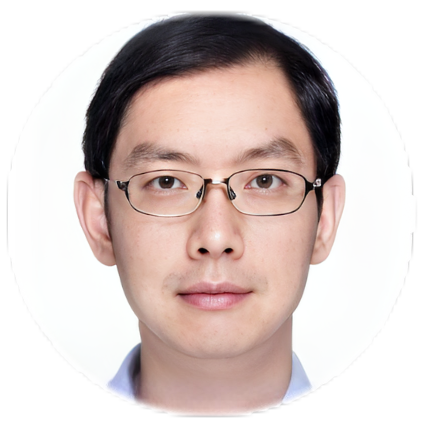
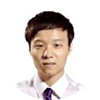

---

title: Natural Language Processing - A Machine Learning Perspective
subtitle: WestlakeNLP · 2022

# Summary for listings and search engines
summary: |-
  **WestlakeNLP · 2022**
  
  This online course is based on the recently released textbook, Natural Language Processing - a Machine Learning Perspective, written by Dr. Yue Zhang & Dr. Zhiyang Teng and published by Cambridge University Press. The course is taught in Chinese, English version of the class will be updated in future releases. Professor Yue Zhang is the principal inverstigator of the Text Intelligence Lab, Westlake University, and a well-known NLP researcher. You may find more detailed information at his personal page or Google Scholar. Course updates are in progress on our bilibili account, WestlakeNLP, do not hesitate to follow us! In this page, we will keep updating course slides.

# location: Wowchemy HQ
# address:
#   street: 450 Serra Mall
#   city: Stanford
#   region: CA
#   postcode: '94305'
#   country: United States

# Talk start and end times.
#   End time can optionally be hidden by prefixing the line with `#`.
# date: '2030-06-01T13:00:00Z'
# date_end: '2030-06-01T15:00:00Z'
# all_day: false

# Schedule page publish date (NOT talk date).
# publishDate: '2017-01-01T00:00:00Z'

# authors:
#   - admin
#   - 吳恩達
# authors: []
tags:
  - Natural Language Processing

# Is this a featured talk? (true/false)
featured: false

# image:
#   caption: 'Image credit: [**Unsplash**](https://unsplash.com/photos/bzdhc5b3Bxs)'
#   focal_point: Right

# links:
#  - icon: twitter
#    icon_pack: fab
#    name: Follow
#    url: https://twitter.com/georgecushen
# url_code: ''
# url_pdf: ''
# url_slides: ''
# url_video: ''

# Markdown Slides (optional).
#   Associate this talk with Markdown slides.
#   Simply enter your slide deck's filename without extension.
#   E.g. `slides = "example-slides"` references `content/slides/example-slides.md`.
#   Otherwise, set `slides = ""`.
# slides: example

# Projects (optional).
#   Associate this post with one or more of your projects.
#   Simply enter your project's folder or file name without extension.
#   E.g. `projects = ["internal-project"]` references `content/project/deep-learning/index.md`.
#   Otherwise, set `projects = []`.
# projects:
#   - example
---

{}
#### **Updates**
+ Our class is now forwarded to [Zhihu](https://www.zhihu.com/education/video-course/1564218549538607104?section_id=1566029317481652224)，feel free to follow us!
+ New Lecture is online: Working with two texts [[video](https://www.bilibili.com/video/BV1td4y1r7pw?t=0.5)] [[slides](https://westlakenlp.github.io/nlpml/static_files/presentations/slide17.pdf)]
+ New Lecture is online: Neural structured prediction [[video](https://www.bilibili.com/video/BV1CG411V7aY?t=5.5)] [[slides](https://westlakenlp.github.io/nlpml/static_files/presentations/slide16.pdf)]
+ New Lecture is online: Representation learning [[video](https://www.bilibili.com/video/BV16v4y1c7uF?t=1.2)] [[slides](https://westlakenlp.github.io/nlpml/static_files/presentations/slide15.pdf)]
+ New Assignment released: [[Assignment #9 - chapter 9](https://westlakenlp.github.io/nlpml/assignments/09_assignment)]
+ New Lecture is online: Transition-based method for structure prediction [[video](https://www.bilibili.com/video/BV13R4y1w7pd?t=2.5)] [[slides](https://westlakenlp.github.io/nlpml/static_files/presentations/slide13.pdf)]
+ New Assignment released: [[Assignment #8 - chapter 8](https://westlakenlp.github.io/nlpml/assignments/08_assignment)]
{}

## Course Description

This online course is based on the recently released textbook, [Natural Language Processing - a Machine Learning Perspective](https://www.cambridge.org/core_title/gb/509717), written by Dr. Yue Zhang & Dr. Zhiyang Teng and published by Cambridge University Press. The course is taught in Chinese, English version of the class will be updated in future releases. Professor Yue Zhang is the principal inverstigator of the Text Intelligence Lab, Westlake University, and a well-known NLP researcher. You may find more detailed information at his [personal page](https://frcchang.github.io/) or [Google Scholar](https://scholar.google.com/citations?user=6hA7WmUAAAAJ&hl=zh-CN&oi=ao). Course updates are in progress on our bilibili account, [WestlakeNLP](https://space.bilibili.com/639900532), do not hesitate to follow us! In this page, we will keep updating course slides.

## Instructors

<table width="100%" align="center">
    <tr>
        <td align="center" style="margin-bottom:40px"><h4><a href="https://frcchang.github.io/" style="text-decoration: none;">Zhang Yue</a></h4>Tenured Full Professor</td>
    </tr>
</table>

## Teaching Assistants

<table width="100%" align="center">
    <tr>
        <td align="center" style="margin-bottom:40px"><h4><a href="https://scholar.google.com/citations?user=8P23zSkAAAAJ&hl=en" style="text-decoration: none;">Chen Yulong</a></h4></td>
        <td align="center" style="margin-bottom:40px"><h4><a href="https://scholar.google.com/citations?user=UOoP794AAAAJ&hl=zh-CN" style="text-decoration: none;">Fu Qiankun</a></h4></td>
        <td align="center" style="margin-bottom:40px"><h4><a href="https://www.dtalg.com/" style="text-decoration: none;">Liu Hanmeng</a></h4></td>   
        <td align="center" style="margin-bottom:40px"><h4>Liu Pai</h4></td>                        
    </tr>
</table> 

## Materials

### **Book**

[Natural Language Processing - A Machine Learning Perspective](https://www.cambridge.org/core_title/gb/509717)

### **Additional Course Materials**

+ Other recomend textbooks and reading materials (update continuing).
+ [Material #1](https://web.stanford.edu/~jurafsky/slp3/): Speech and Language processing

## Lectures

You can download the lectures here. We will try to upload lectures prior to their corresponding classes.


## Assignments

You can download the assignments here. Also check out each assignment page for any additional info.
#### **Late Policy**
- You have free 8 late days.
- You can use late days for assignments. A late day extends the deadline 24 hours.
- Once you have used all 8 late days, the penalty is 10% for each additional late day.

