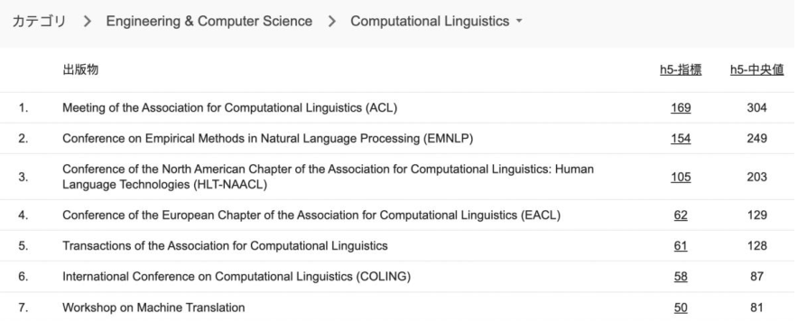

## Intro

Regarding the field of artificial intelligence, conferences are more important than journals. According to Google Scholar statistics, the Meeting of the Association for Computational Linguistics (ACL) is the most important publication venue in the field of artificial intelligence - natural language processing and the only CCF-A class conference in this area. The acceptance rate is consistently around 20%. 

WestlakeNLP has accepted **14 long papers to ACL-2023** held in Canada, including 9 papers in the Main track and 5 papers in the Findings track.
